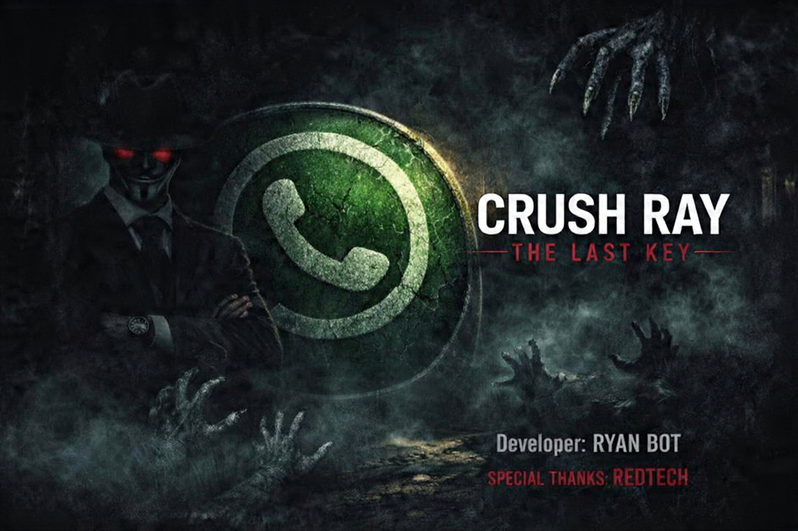

# 💖 CRUSH RAY BOT

<div align="center">
  
  <h3>A Powerful WhatsApp Bot with 50+ Commands</h3>
  
  [](https://github.com/yourusername/crush-ray-bot.git)
  [](https://whatsapp.com/channel/0029VbCne5677qVRVvdVAn1b)
</div>

## 👤 Bot Information
| Field | Value |
|-------|-------|
| **Bot Name** | CRUSH RAY |
| **Owner** | PRESENTER RAY |
| **Developer** | RAY |
| **Contact** | 0757829372 |
| **Version** | 1.0.0 |
| **Repository** | https://github.com/yourusername/crush-ray-bot.git |
| **WhatsApp Channel** | https://whatsapp.com/channel/0029VbCne5677qVRVvdVAn1b |

## 📢 Join Our WhatsApp Channel
Stay updated with the latest features, commands, and announcements!

**Channel Link:** https://whatsapp.com/channel/0029VbCne5677qVRVvdVAn1b

**Benefits of joining:**
- Latest bot updates
- New commands announcements
- Bug fixes & improvements
- Tutorials & tips
- 24/7 support

## ✨ Features

### 📱 General Commands
- `.menu` - Show all commands
- `.ping` - Check bot response time
- `.alive` - Check bot status
- `.owner` - Contact owner
- `.github` - Get GitHub repository
- `.channel` - Join WhatsApp channel
- `.mode` - Toggle public/private mode

### 🛠️ Moderation
- `.ban` / `.unban` - Ban/unban users
- `.warn` / `.warnings` - Warning system
- `.kick` - Remove from group
- `.promote` / `.demote` - Admin management
- `.mute` / `.unmute` - Group mute
- `.tagall` / `.hidetag` - Mass mentions

### 🔗 Anti-Spam
- `.antilink` - Block links
- `.antitag` - Block mass tags
- `.antibadword` - Block bad words
- `.anticall` - Block calls
- `.pmblocker` - Block private messages

### 🎨 Media Tools
- `.sticker` - Create stickers
- `.toimg` - Sticker to image
- `.tourl` - Upload to URL
- `.attp` - Text to sticker
- `.emojimix` - Mix emojis

### 🎵 Downloaders
- `.play` / `.song` - Download music
- `.ytsearch` - YouTube search
- `.instagram` - IG downloader
- `.facebook` - FB downloader
- `.tiktok` - TikTok downloader
- `.spotify` - Spotify downloader

### 🤖 AI Features
- `.ai` - Chat with AI
- `.chatbot` - Auto responses
- `.imagine` - AI image generation
- `.tts` - Text to speech
- `.translate` - Language translation

### 🎮 Games
- `.tictactoe` - Play Tic Tac Toe
- `.ship` - Compatibility checker
- `.simp` - Simp meter
- `.truth` / `.dare` - Party game

### 💖 Fun Commands
- `.flirt` - Flirt with someone
- `.compliment` - Give compliments
- `.insult` - Playful insults
- `.joke` / `.quote` / `.fact` - Random fun

## 🚀 Installation

### Prerequisites
- Node.js 18+
- npm or yarn
- FFmpeg (for sticker conversion)

### Steps
```bash
# Clone repository
git clone https://github.com/yourusername/crush-ray-bot.git
cd crush-ray-bot

# Install dependencies
npm install

# Start the bot
npm start
